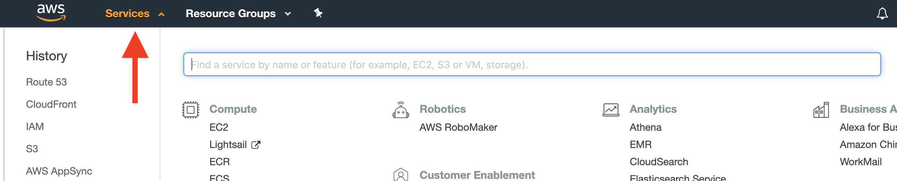

- visit [http://console.aws.amazon.com](http://console.aws.amazon.com/) and create an account/sign in
- the main part of the UI to be aware of is the "Services" pane; this is how you navigate between all the different pieces of AWS. the "History" column on the left shows your most recently used services, so you can move back to where you recently were

