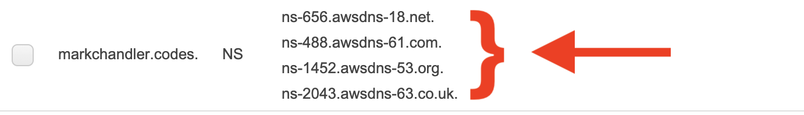

- From the namecheap main page, sign in using the Sign In drop-down in the top left

- From your Dashboard, find your domain and click "Manage"

- From the domain dashboard, find the "Nameservers" section. It will set to "Namecheap BasicDNS" by default. Change that to "Custom DNS" and text fields will appear
- Add each nameserver listed in your domain's Hosted Zone NS entry in Route 53. You can use the "Add Nameserver" button to add additional entries. Then press the green checkmark to save

- As the success alert notes when you save, dns changes can take up to 48 hours to propagate
