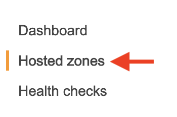
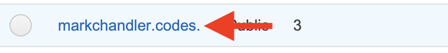
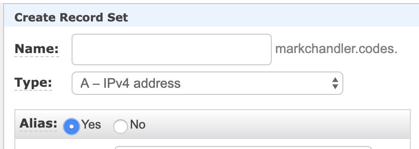
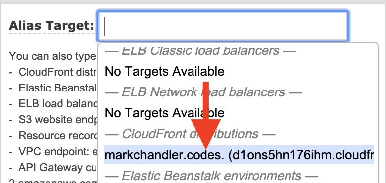
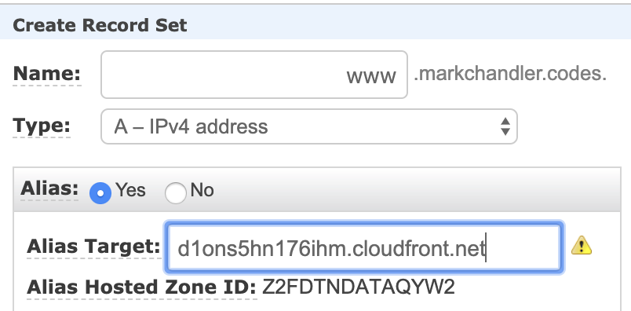
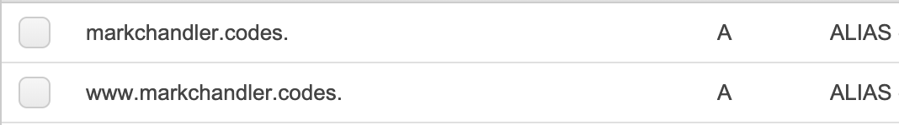

- Navigate back to Route53
- Click on "Hosted Zones" in the left sidebar

- Click on the link to your domain's hosted zone

- In the top menu, click the "Create Record Set" button

- Leave the "Name" empty and set "Alias" to "Yes"

- Click the "Alias Target" input and select your "CloudFront Distribution", then click the "Create" button

- After creating this alias, follow the same steps as above, but set "Name" to "www"

- You should then see an alias for both your domain and www.domain

