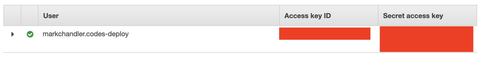

## Creating Secrets for our repository

- GitHub repositories can be configured with `Secrets`, encrypted values referenced in our workflows. This is a secure way to store the aws variables we need in order to use the `aws` cli
- Go to the "Secrets" settings panel


- From here we'll add four secrets

  - `AWS_ACCESS_KEY_ID` & `AWS_SECRET_ACCESS_KEY`

  

  - `AWS_S3_BUCKET`

  

  - `AWS_CLOUDFRONT_DISTRIBUTION_ID`

  


## Configuring `master.yml`

- Create the `.github` folder and `master.yml` workflow: `mkdir -p .github/workflows && touch .github/workflows/master.yml`
- Open the file in your editor
- Give your workflow a name: `name: "master"`
- Configure the workflow to run on any pushes to the `master` branch

```yaml
on:
  push:
    branches: - "master"
```

- Set up our new job and name it `build-and-deploy`. This will run our job on the `ubuntu-latest` image

```yaml
jobs:
  build-and-deploy:
    name: 'build-and-deploy'
    runs-on: 'ubuntu-latest'
```

- Now we'll configure a few `actions` that our workflow will use. `checkout` retrieves our code, `setup-node` installs `node` and `chrislennon/action-aws-cli` gives us access to the `aws` cli

```yaml
jobs:
  build-and-deploy:
    name: "Build and deplo"
    runs-on: "ubuntu-latest"
    steps:
      - uses: "actions/checkout@master"
      - uses: "actions/setup-node@master"
        with:
          node-version: "10.x" - uses: "chrislennon/action-aws-cli@1.1"
```

- Now we'll install our `node_modules` and run the `build` script so that `gatsby` builds our output

```yaml
- run: 'npm install'
- name: 'Build the gatsby project'
  run: 'npm run build'
```

- Now that we have our build output, we'll deploy it to `s3`

```yaml
- name: "Deploy the build to s3"
  run: "aws s3 sync ./public s3://${AWS_S3_BUCKET} --delete"
    env:
      AWS_REGION: "us-east-1"
      AWS_S3_BUCKET: "${{ secrets.AWS_S3_BUCKET }}"
      AWS_ACCESS_KEY_ID: "${{ secrets.AWS_ACCESS_KEY_ID }}"
      AWS_SECRET_ACCESS_KEY: "${{ secrets.AWS_SECRET_ACCESS_KEY }}"
```

- The last step is to send a Cloudfront invalidation so that it updates the cache

```yaml
- name: 'Send CloudFront invalidation'
  run: |
    aws cloudfront create-invalidation \
    --distribution-id ${AWS_CLOUDFRONT_DISTRIBUTION_ID} \
        --paths "/*"
  env:
    AWS_CLOUDFRONT_DISTRIBUTION_ID: '${{ secrets.AWS_CLOUDFRONT_DISTRIBUTION_ID }}'
    AWS_ACCESS_KEY_ID: '${{ secrets.AWS_ACCESS_KEY_ID }}'
    AWS_SECRET_ACCESS_KEY: '${{ secrets.AWS_SECRET_ACCESS_KEY }}'
```

- The final `master.yml` looks like this:

```yaml
name: "master"

on:
  push:
    branches: - "master"

jobs:
  build-and-deploy:
    name: "Build and deploy"
    runs-on: "ubuntu-latest"
    steps:
      - uses: "actions/checkout@master"
      - uses: "actions/setup-node@master"
        with:
          node-version: "10.x"
      - uses: "chrislennon/action-aws-cli@1.1"
      - run: "npm install"
      - name: "Build the gatsby project"
        run: "npm run build"
      - name: "Deploy the build to s3"
        run: "aws s3 sync ./public s3://${AWS_S3_BUCKET} --delete"
        env:
          AWS_REGION: "us-east-1"
          AWS_S3_BUCKET: "${{ secrets.AWS_S3_BUCKET }}"
          AWS_ACCESS_KEY_ID: "${{ secrets.AWS_ACCESS_KEY_ID }}"
          AWS_SECRET_ACCESS_KEY: "${{ secrets.AWS_SECRET_ACCESS_KEY }}"
      - name: "Send CloudFront invalidation"
        run: |
          aws cloudfront create-invalidation \
            --distribution-id ${AWS_CLOUDFRONT_DISTRIBUTION_ID} \
            --paths "/*"
        env:
          AWS_CLOUDFRONT_DISTRIBUTION_ID: "${{ secrets.AWS_CLOUDFRONT_DISTRIBUTION_ID }}"
          AWS_ACCESS_KEY_ID: "${{ secrets.AWS_ACCESS_KEY_ID }}"
          AWS_SECRET_ACCESS_KEY: "${{ secrets.AWS_SECRET_ACCESS_KEY }}"
```

- Now that we've created our workflow, we need to check it in and push it to GitHub: `git add . && git commit -m "add master workflow" && git push -u origin master`
- Now we should be able to see our Action running
- Go to the Actions tab of your repository


- You should see our `master` workflow running


- If you click on the workflow name, you can see the workflow steps running


- If everything works out, you'll see a green checkmark next to the action


- Now you should be able to navigate to your domain and see the result of your efforts!


