- Navigate to CloudFront using the Services pane
- Click the main "CloudFront Distributons" screen, click the "Create Distribution" button

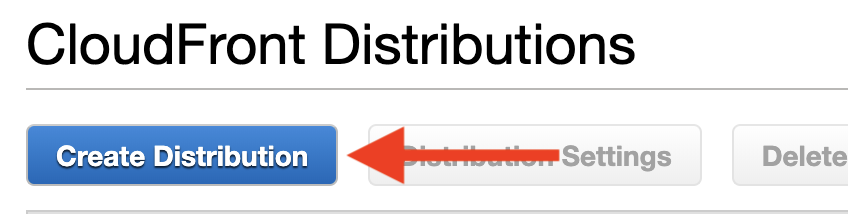

- Click the "Get Started" button under the "Web" section

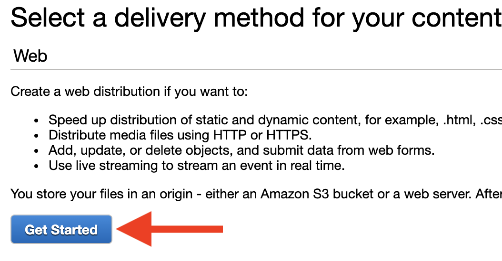

- Click the "Origin Domain Name" and select the entry corresponding to the domain (domain.com.s3.amazonaws.com) from the "Amazon S3 Buckets" section of the dropdown

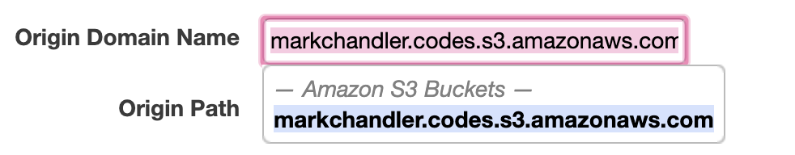

- Change "Restrict Bucket Access" to "Yes"
- Select "Create a New Identity" for "Origin Access Identity", change "Comment" to the domain name (domain.com), and select "Yes, Update Bucket Policy" for "Grant Read Permissions on Bucket"

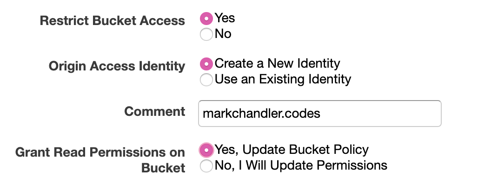

- Viewer Protocol Policy: “Redirect HTTP to HTTPS”

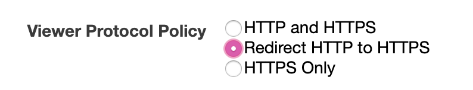

- Alternate Domain Names: "www.domain.com" and “domain.com”

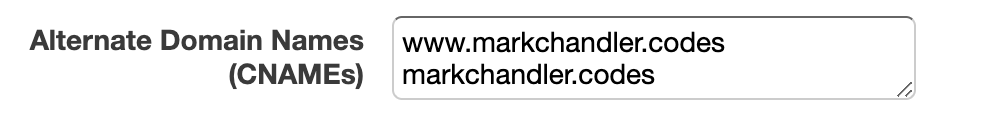

- SSL Certificate: “Custom SSL Certificate” and select “domain.com” from the dropdown list. This attaches the certificate we created earlier to this distribution

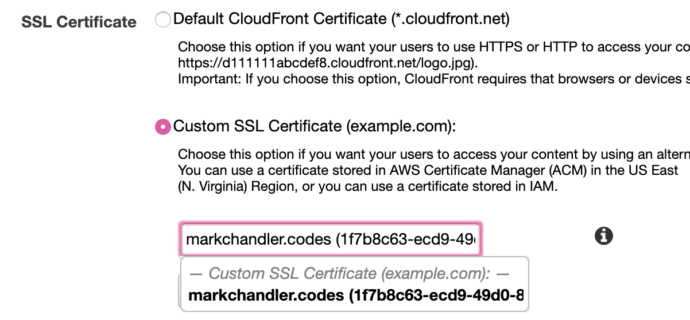

- Default Root Object: index.html

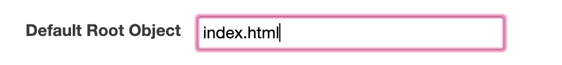

- click "Create Distribution" and then click "Distributons" in the sidebar to the return to the main "CloudFront Distributions" screen. you should now see the distribution in the list

### Set up the error page

- Click on the distributon ID link

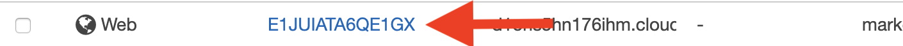

- Click the "Error Pages" tab

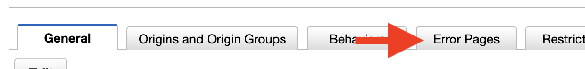

- Click the "Create Custom Error Response" button

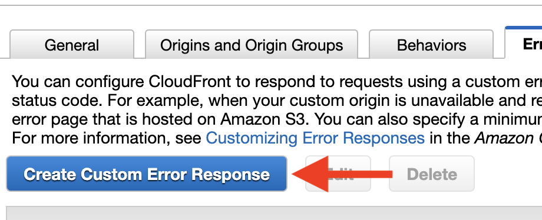

- HTTP Error Code: “400: Bad Request” with 0 TTL, Customize Error Response to “Yes”, Response Page Path as “/index.html”, and HTTP Response Code as “200: OK” and then click "Create"

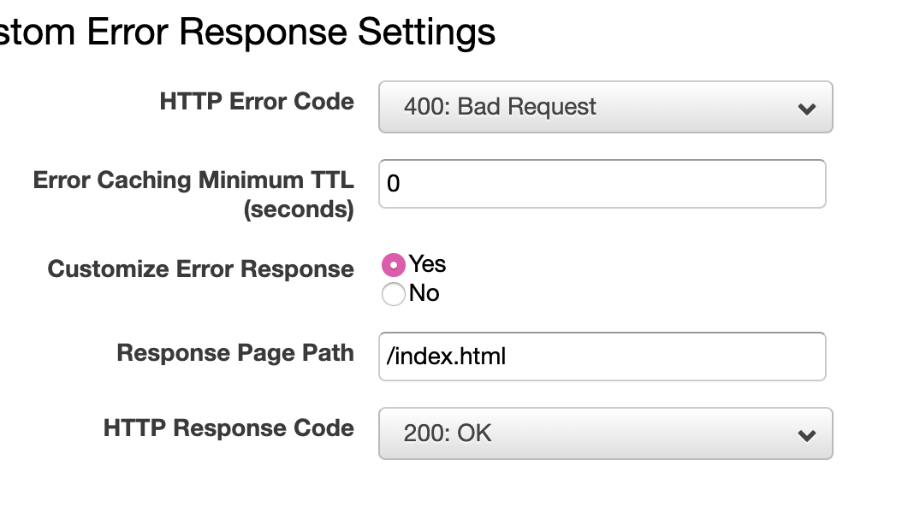

- Click "Create Custom Error Response" again
- HTTP Error Code: “403: Forbidden” with 0 TTL, Customize Error Response to “Yes”, Response Page Path as “/index.html”, and HTTP Response Code as “200: OK” and then click "Create"

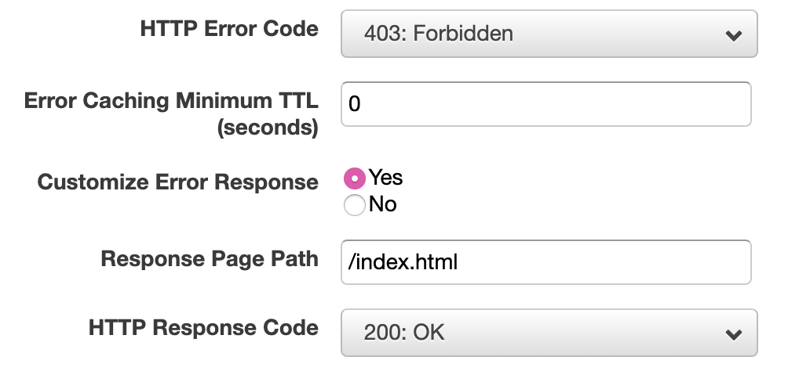
