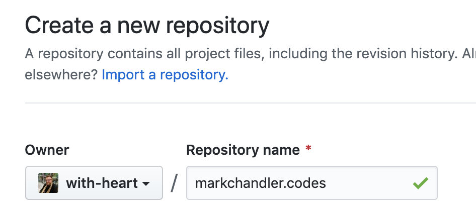
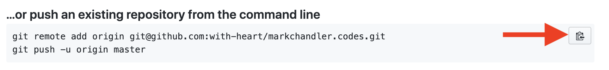

# Gatsby

- Gatsby is a static site generator, meaning that we can use it to create static html output
- `npm i -g gatsby-cli`
- Create a project folder using `gatsby-starter-blog-theme`: `gatsby new markchandler.codes [https://github.com/gatsbyjs/gatsby-starter-blog-theme](https://github.com/gatsbyjs/gatsby-starter-blog-theme)`
- Enter the project folder `cd markchandler.codes`
- Initialize the folder as a `git` repo and create an initial commit with these files: `git init && && git add . && git commit -m "initialize repo"`
- Open `src/gatsby-theme-blog/components/bio-content.js` and add some bio text inside the `Fragment` tag. This is displayed at the top of the index of your blog and under each post, so customize it and make it yours

```jsx
export default () => (
  <Fragment>
    Welcome to{' '}
    <Styled.a href="http://markchandler.codes/">markchandler.codes</Styled.a>
    {` `}, a blog about code.
  </Fragment>
)
```

- The bio also shows an avatar. This comes from `content/assets/avatar.png`. Replace that file with your own avatar, making sure it keeps the same `avatar.png` filename
- Now we'll commit these changes: `git add . && git commit -m "update bio and avatar"`

## Push the changes to GitHub

- from github.com, click on the + button in the top right and click "New repository"


- Set "Repository name" to the domain (`domain.com`) and then click "Create repository"



- Click the copy button under the "…or push an existing repository from the command line" section, paste that in your terminal, and then hit enter. This will add our GitHub repo as our git `origin` and push the code to the repo



- You can then refresh the page and you'll see your project files in the repository


