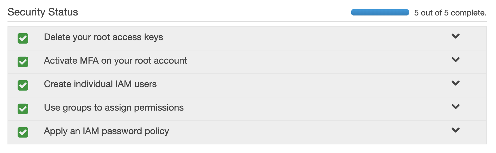
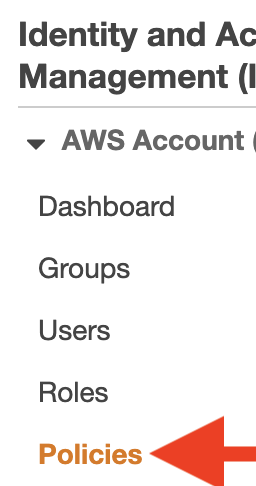
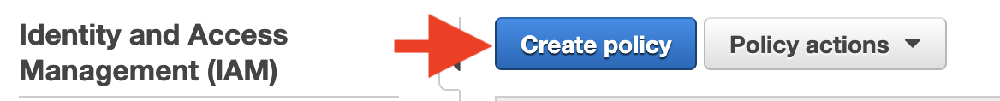
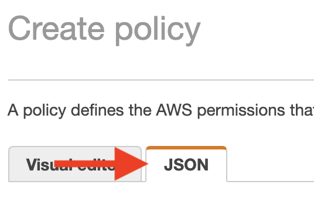
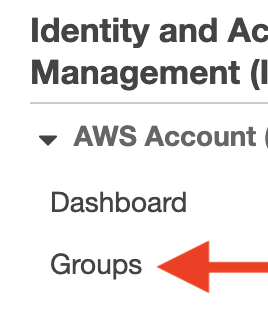
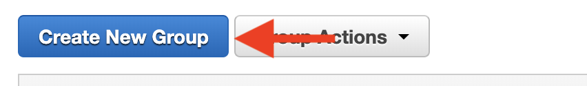
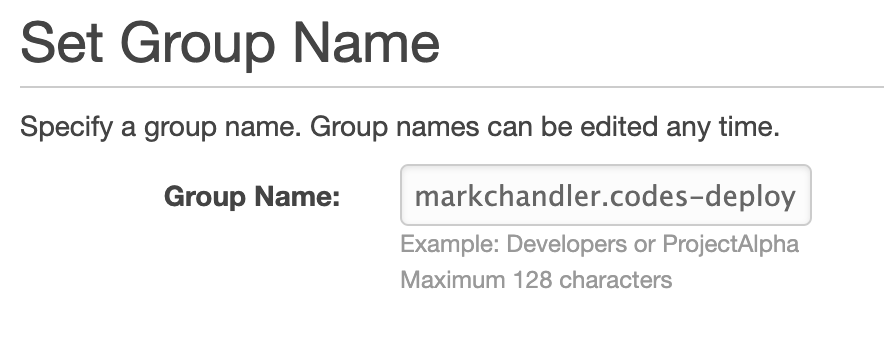
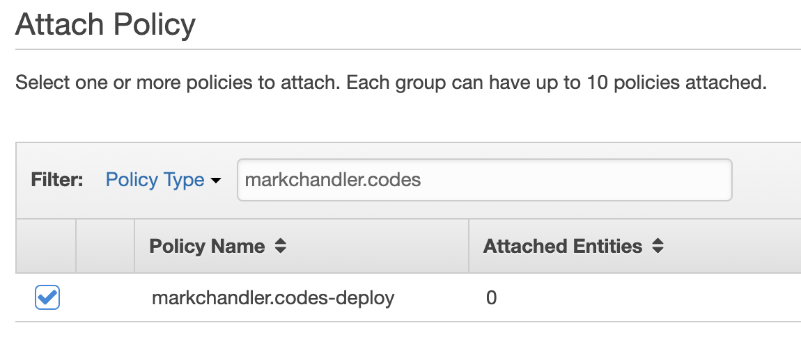
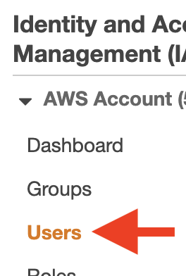
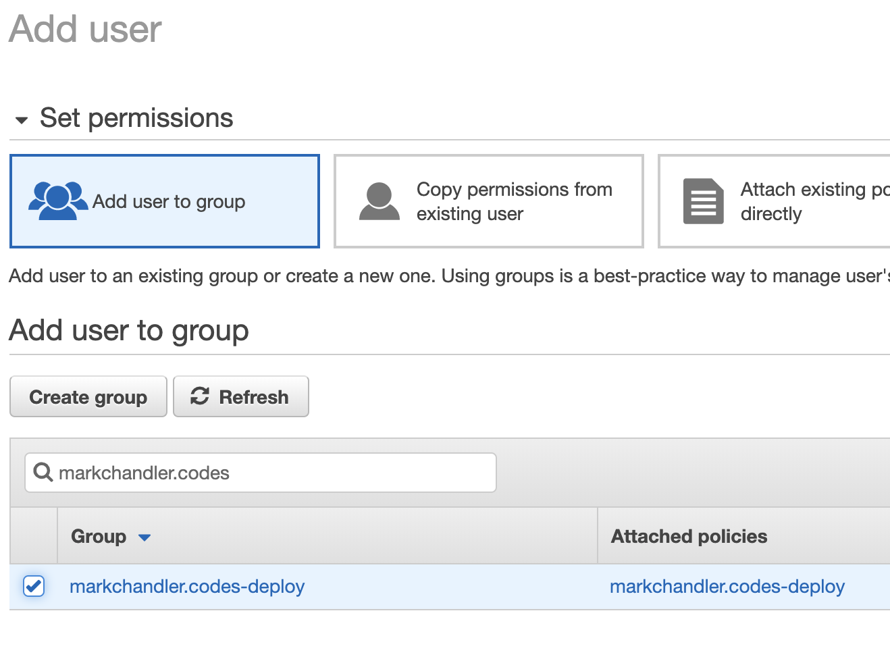

- In order to deploy our site, we need to create a user with access to our resources. It's recommended for security purposes that we create a policy with access to the specific resources needed, attach that policy to a group, and then create a user that we add to the group
- aws manages policies/groups/users in IAM
- Navigate to IAM through the Services pane
- The main IAM dashboard lists some recommended security steps for your account. We won't walk through those here as they include instructions, but I highly recommend that you take time to make sure they all pass



# Create deployment and invalidation policy

- From the sidebar, select the Policies link



- Click the "Create policy" button at the top



- The Visual editor allows you to interactively create a policy, but for the purposes of this, we'll just use a `json` policy. Click the "JSON" tab



- In the text box, replace the existing text with this `json` block. Be sure to replace the domain under the `"Resource"` block with your domain (`arn:aws:s3:::domain.com`, `arn:aws:s3:::domain.com/\*`). Then click the "Review policy" button

```json
{
  "Version": "2012-10-17",
  "Statement": [
    {
      "Sid": "S3",
      "Effect": "Allow",
      "Action": [
        "s3:PutObject",
        "s3:GetObject",
        "s3:ListBucket",
        "s3:DeleteObject",
        "s3:GetBucketLocation"
      ],
      "Resource": [
        "arn:aws:s3:::markchandler.codes",
        "arn:aws:s3:::markchandler.codes/*"
      ]
    },
    {
      "Sid": "Cloudfront",
      "Effect": "Allow",
      "Action": "cloudfront:CreateInvalidation",
      "Resource": "*"
    }
  ]
}
```

- At the review screen, we'll enter a name for our policy and a brief description. You'll also see `CloudFront` and `S3` listed in the summary. Once you're finished, press "Create Policy"


# Create deployment and invalidation group

- Now that we have our policy, we need to create a group to attach it to. In the left sidebar, navigate to "Groups"



- Click the "Create New Group" button at the top



- Set your group name and then click "Next Step" in the bottom right



- Now search for the policy we created before and select it before clicking "Next Step"



- At the next screen, verify that the information is correct and then click "Create Group"

# Create our deployment/invalidation user

- The final step is to create the user that will actually be used for our deployment and invalidation and add them to our group
- Click the "Users" link in the left sidebar



- Click the "Add user" button in the top menu


- At the next screen, enter the name for your user and select "Programmatic access" for the Access type, and then click "Next: Permissions"


- At the Permissions screen, search for the group we created previously and select it before clicking the "Next: Tags" button



- We can skip the Tags screen. Click the "Next: Review" button
- At the review screen, verify that your User name is correct and that it is attached to the correct group, and then click "Create user"


- The next screen shows our newly-created user. It's important that you save the "Access key ID" and the "Secret access key" for this user, as we'll need them to them in our GitHub Actions


