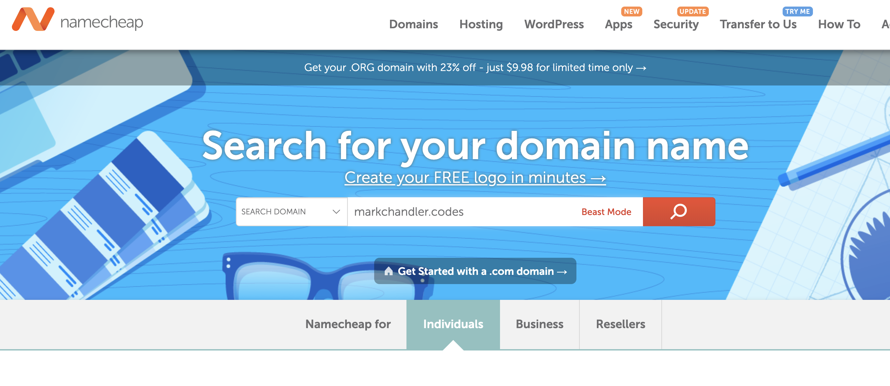
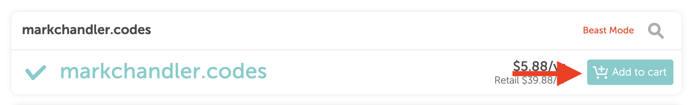
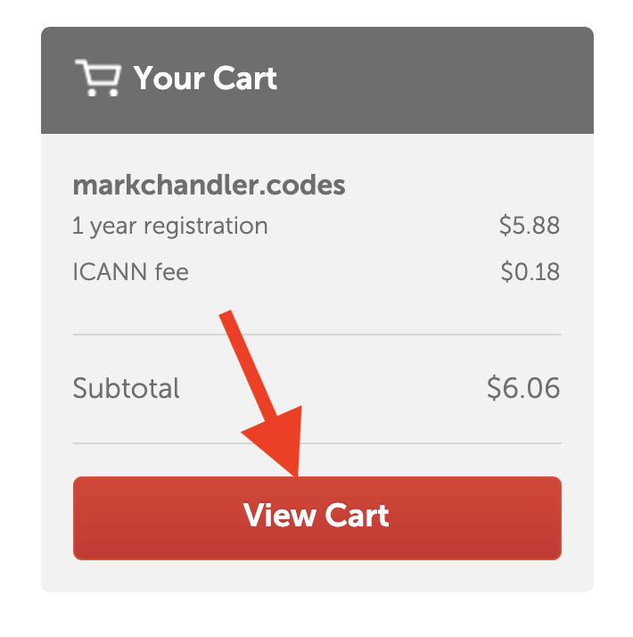
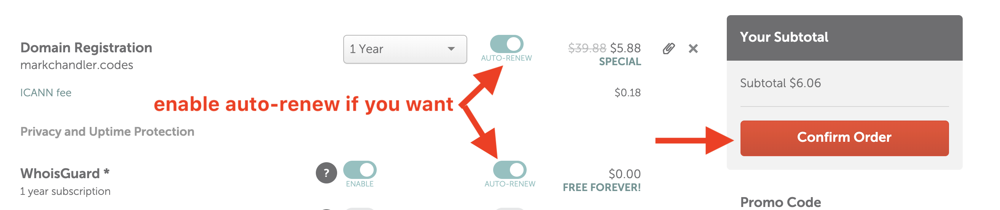
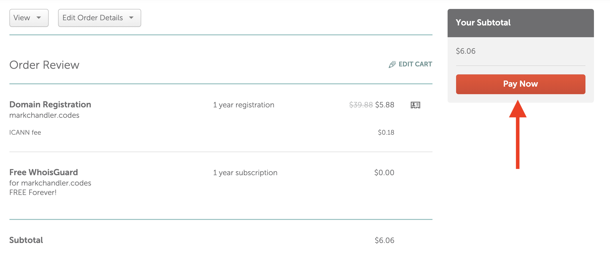

- navigate to namecheap.com
- search for your domain name

- find your domain and click "Add to cart"

- select "View Cart" to checkout

- enable "auto-renew" for the domain and WhoisGuard (free) if you want to automatically be charged for the domain before it expires, and then click "Confirm Order"

- log in or create an account
- fill out payment and billing details
- review your order to make sure it's correct, then select "Pay Now" to finish the transaction

- we're finished with namecheap for now. we'll come back to this when we move into the AWS/Route 53 step
