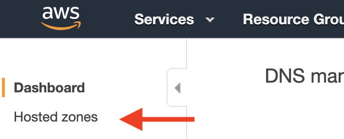

- navigate to Route 53 using the Services pane
- Route 53 allows us to manage the dns for a domain, allowing us to route a domain to the correct aws resources
- We'll create a Hosted Zone–a container that holds information about how you want to route traffic for a domain and its subdomains–for our domain so that we can eventually point our zones to the AWS resources that make up our domain
- Select the "Hosted Zones" link in the sidebar

- From here, click "Create Hosted Zone" to add our domain. Set the "Domain Name" to "domain.com" and make sure the type is "Public Hosted Zone" and then click "Create" at the bottom to the create the zone
- By itself, a hosted zone doesn't do anything. We need to point our Namecheap domain to our new Route 53 nameservers, so we can use Route 53 to control the domain
- In your domain's Hosted Zone dashboard, take note of the Value of the listing with a Type of NS. the addresses listed in Value will be used in the Namecheap dashboard

