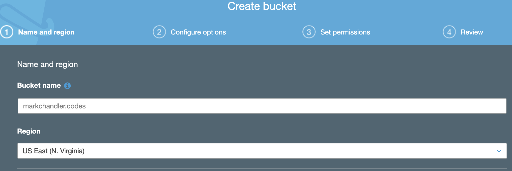

- Next we'll create an S3 bucket to hold the actual files for your site
- Navigate to S3 using the Services pane
- Click the "Create bucket" button

- Set the "Bucket name" to the domain name (domain.com) and then click the "Next" button

- On the "Configure options" screen, we'll leave the settings to the defaults and click "Next"
- On the "Set permissions" screen, validate that "Block all public access" is checked and then click "Next"

- On the "Review" screen, click "Create bucket"
- You should see your bucket listed on the main "S3 buckets" screen

