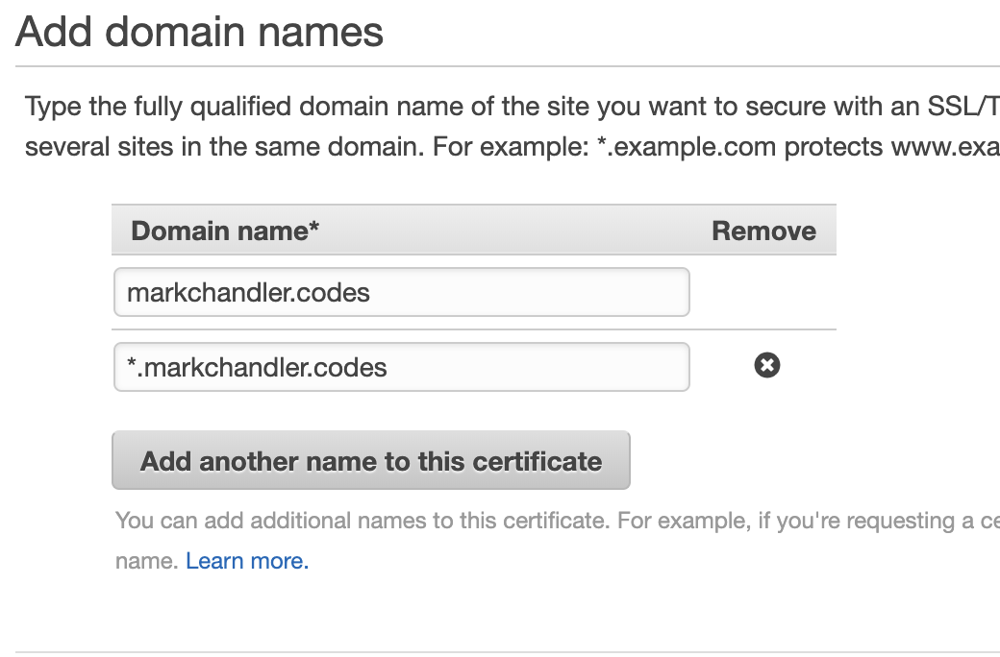
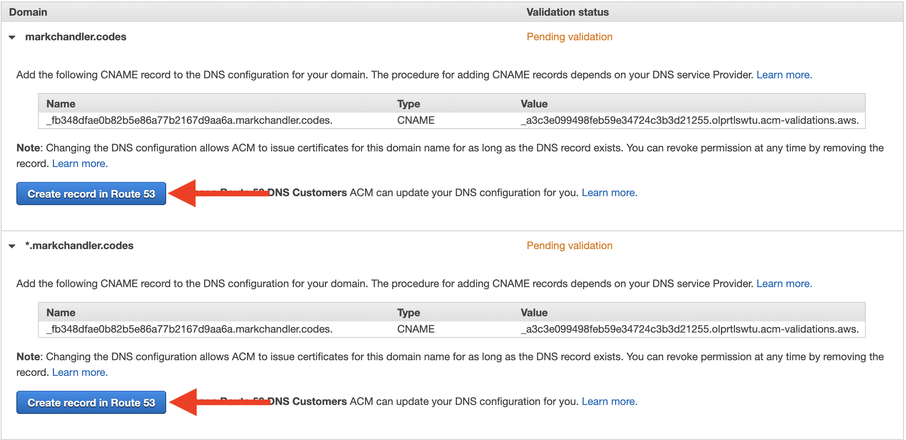
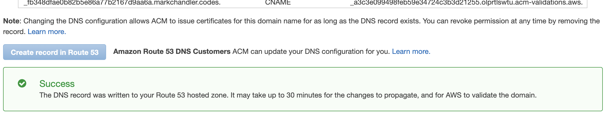
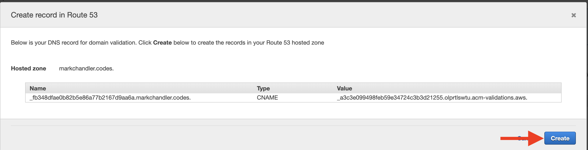

- aws allows us to create a certificate for our domain so that we can use ssl (https)
- navigate to Certificate Manager using the Services pane
- Click the "Request a certificate" button
- Verify that "Request a public certificate" is selected, and then click the "Request a certificate button"
- Add the base domain (domain.com) name and a wildcard name for subdomains (\*.domain.com) and then click the "Next" button

- Request a public certificate for: domain.com, domain.com, \*.domain.com
- Verify that "DNS validation" is selected and then click the "Review" button

- Verify that your "Domain Name" is the domain (domain.com), "Additional name" is the wildcard domain (\*.domain.com), "Validation method" is "DNS", and then click “Confirm and Request”
- For or each domain click the arrow next to the domain name and then click "Create Record in Route 53". A modal will popup, and you'll click "Create". This will automatically add the certificate for each domain as a CNAME. You'll see a "Success" alert under each domain if this works

- Click "Continue" to complete this step. The domains may list them as "Pending", which is fine
